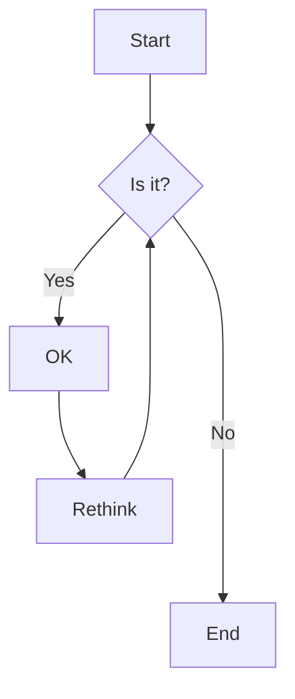

# ppcamp.github.io

This repository contains the hugo code that I use in my portfolio website (my
blog).


## Usefull links

- [Hugo quickstart](https://gohugo.io/getting-started/quick-start/)
- [How to add fontawesome in hugo](https://matze.rocks/posts/fontawesome_in_hugo/)
- [Mermaid graphs](https://mermaid-js.github.io/mermaid/#/flowchart)
- [Adding diagrams to websites](https://codewithhugo.com/mermaid-js-hugo-shortcode/)

## Tips

Watch changes:

```bash
hugo server -w -D
```


## Shortcuts

<pre>

graph TD;
  A-->B;
  A-->C;
  B-->D;
  C-->D;

</pre>


## Mermaid

